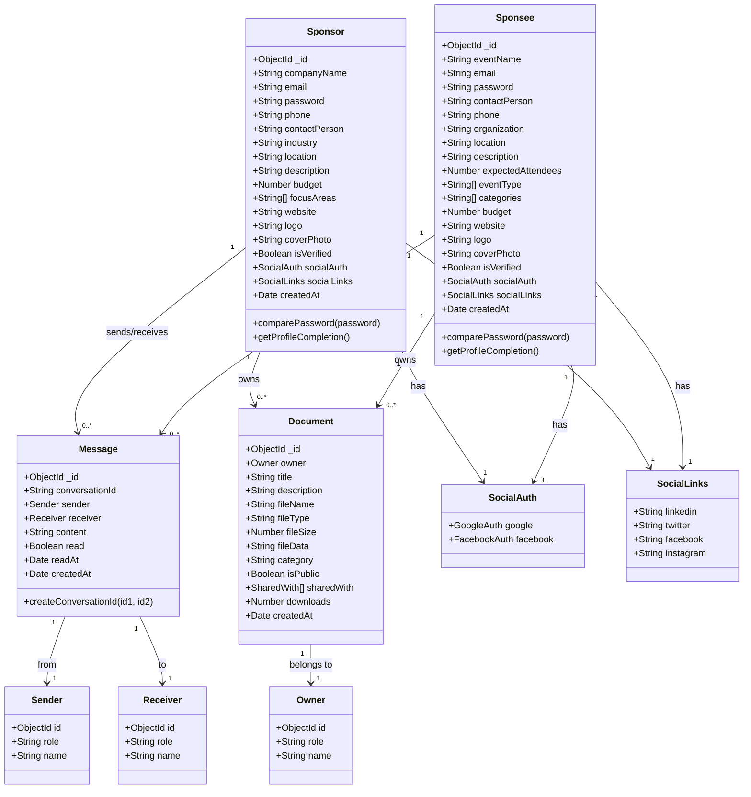
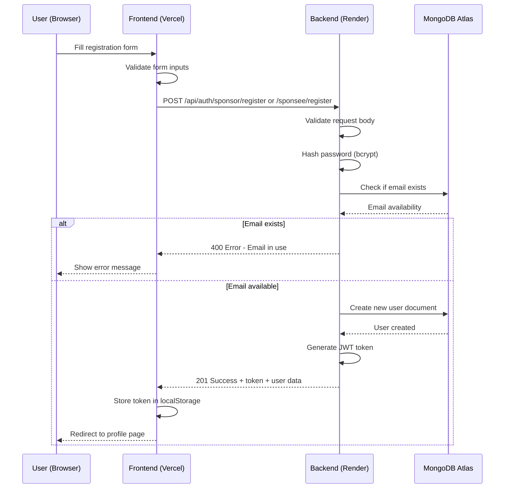
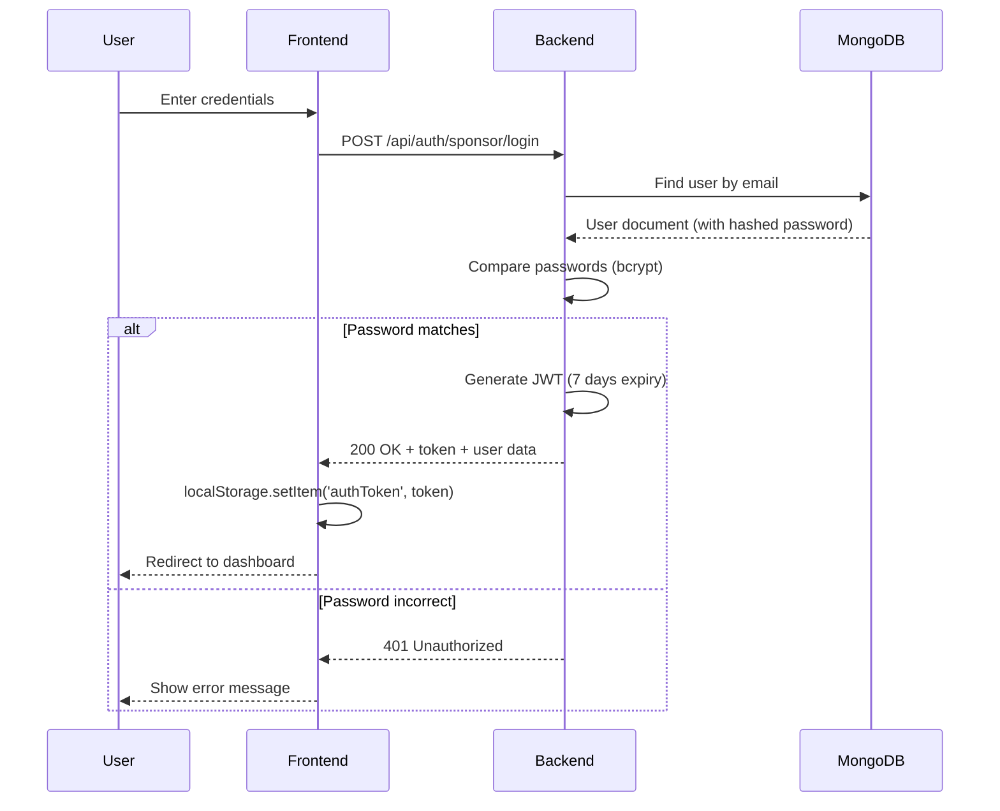
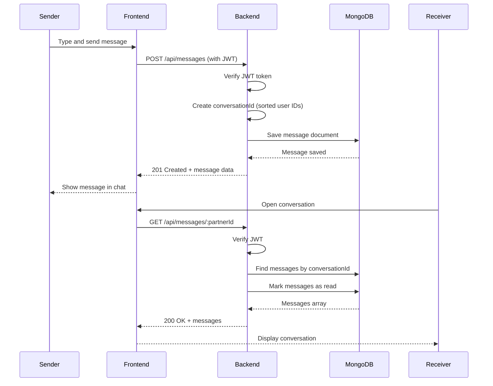
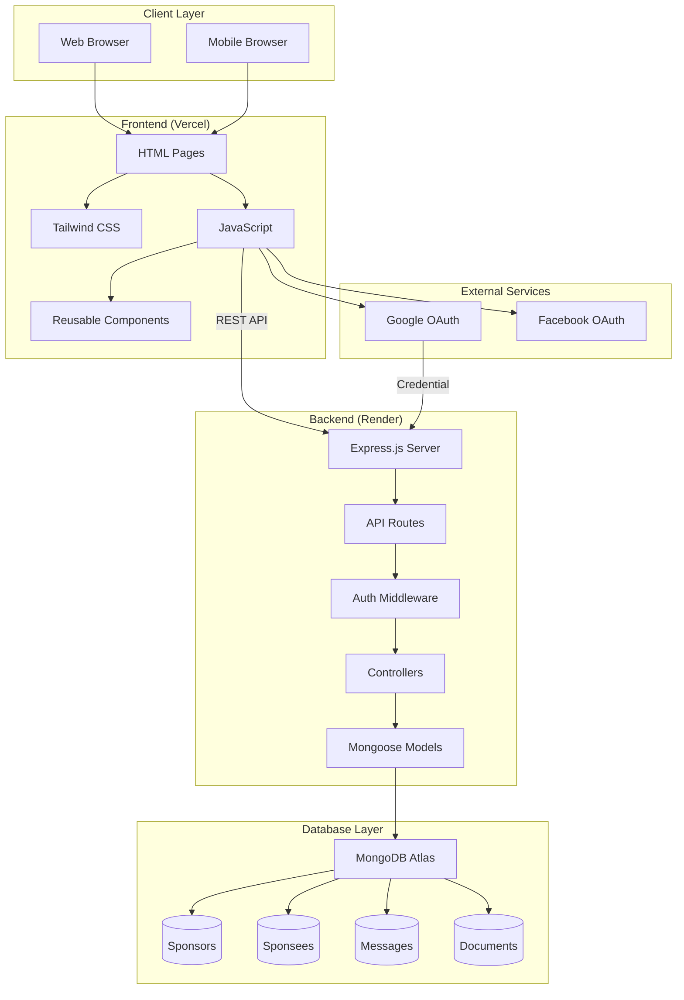

# SponzoBD - Project Overview

## 📋 Project Description

**SponzoBD** is Bangladesh's premier sponsorship matching platform that connects **Sponsors** (companies/brands) with **Sponsees** (event organizers, micro-influencers, content creators). The platform facilitates meaningful partnerships by providing tools for discovery, communication, document sharing, and sponsorship management.

### Core Value Proposition

- **For Sponsors**: Discover verified events and influencers to sponsor, manage sponsorship portfolios, track ROI
- **For Sponsees/Micro-Influencers**: Find sponsors for events/content, showcase portfolios, manage sponsorship requests

---

## 🛠️ Technology Stack

### Frontend

| Technology                   | Purpose                           |
| ---------------------------- | --------------------------------- |
| **HTML5**                    | Page structure                    |
| **Tailwind CSS**             | Utility-first styling             |
| **JavaScript (Vanilla)**     | Client-side logic                 |
| **Font Awesome**             | Icons                             |
| **AOS (Animate on Scroll)**  | Scroll animations                 |
| **Google Fonts**             | Typography (Inter, Space Grotesk) |
| **Google Identity Services** | Social authentication             |

### Backend

| Technology     | Version | Purpose               |
| -------------- | ------- | --------------------- |
| **Node.js**    | v14+    | Runtime environment   |
| **Express.js** | 4.18.2  | Web framework         |
| **MongoDB**    | -       | NoSQL database        |
| **Mongoose**   | 7.0.0   | ODM for MongoDB       |
| **JWT**        | 9.0.0   | Authentication tokens |
| **bcryptjs**   | 2.4.3   | Password hashing      |
| **CORS**       | 2.8.5   | Cross-origin requests |
| **dotenv**     | 16.0.3  | Environment variables |

### Deployment

| Service           | Purpose                                          |
| ----------------- | ------------------------------------------------ |
| **Vercel**        | Frontend hosting (https://sponzobd.vercel.app)   |
| **Render**        | Backend hosting (https://test-6aiv.onrender.com) |
| **MongoDB Atlas** | Cloud database                                   |

---

## 🎯 Features

### 1. **Authentication System**

- Email/Password registration and login
- Google OAuth integration
- Facebook OAuth (coming soon)
- JWT-based session management
- Password reset with email verification
- Remember me functionality
- Dual user types (Sponsor/Sponsee)

### 2. **User Profiles**

- **Sponsor Profile**: Company info, industry, budget, focus areas, logo, cover photo
- **Sponsee Profile**: Event/Influencer info, organization, expected reach, categories
- Profile completion progress tracking
- Social media links (LinkedIn, Twitter, Facebook, Instagram)
- Profile picture and cover photo upload

### 3. **Discovery & Browsing**

- Browse sponsors (for sponsees)
- Browse events/sponsees (for sponsors)
- Category-based filtering
- Search functionality

### 4. **Messaging System**

- Real-time conversations between sponsors and sponsees
- Message read receipts
- Conversation history
- Unread message count

### 5. **Document Management**

- Upload documents (proposals, contracts, invoices, reports)
- Document categorization
- Public/private sharing options
- Share documents with specific users
- Download tracking

### 6. **Dashboard**

- **Sponsor Dashboard**: Active sponsorships, pending requests, total invested, recent activity
- **Sponsee Dashboard**: Sponsorship requests, active sponsors, budget tracking

---

## 📊 Database Model Architecture

### UML Class Diagram (Mermaid)



---

## 🔄 Data Flow Diagram

### UML Sequence Diagram - User Registration Flow



### UML Sequence Diagram - Authentication Flow



### UML Sequence Diagram - Messaging Flow



### System Architecture Diagram



---

## 📁 Project Structure

```
sponzobd/
├── backend/
│   ├── config/
│   │   └── database.js          # MongoDB connection
│   ├── controllers/
│   │   └── authController.js    # Auth logic (register, login, social)
│   ├── middleware/
│   │   └── auth.js              # JWT verification middleware
│   ├── models/
│   │   ├── Sponsor.js           # Sponsor schema
│   │   ├── Sponsee.js           # Sponsee schema
│   │   ├── Message.js           # Message schema
│   │   └── Document.js          # Document schema
│   ├── routes/
│   │   ├── auth.js              # Auth routes
│   │   ├── messages.js          # Messaging routes
│   │   └── documents.js         # Document routes
│   ├── server.js                # Express app entry point
│   ├── seed.js                  # Database seeder
│   └── package.json
│
├── frontend/
│   ├── assets/
│   │   ├── styles.css
│   │   └── images/
│   ├── components/
│   │   ├── navbar.html
│   │   └── navbar.js
│   ├── pages/
│   │   ├── auth/
│   │   │   ├── login.html
│   │   │   ├── signup-choice.html
│   │   │   ├── sponsor-signup.html
│   │   │   ├── sponsee-signup.html
│   │   │   └── forgot-password.html
│   │   ├── dashboards/
│   │   │   ├── sponsor-dashboard.html
│   │   │   └── sponsee-dashboard.html
│   │   ├── profiles/
│   │   │   ├── sponsor-profile.html
│   │   │   └── sponsee-profile.html
│   │   ├── events/
│   │   │   ├── sponsors.html
│   │   │   └── sponsee.html
│   │   ├── messages.html
│   │   └── documents.html
│   ├── index.html               # Landing page
│   └── about.html
│
├── render.yaml                  # Render deployment config
├── vercel.json                  # Vercel deployment config
└── README files
```

---

## 🔐 API Endpoints

### Authentication (`/api/auth`)

| Method | Endpoint            | Description                   |
| ------ | ------------------- | ----------------------------- |
| POST   | `/sponsor/register` | Register new sponsor          |
| POST   | `/sponsor/login`    | Login as sponsor              |
| GET    | `/sponsor/me`       | Get current sponsor profile   |
| PUT    | `/sponsor/update`   | Update sponsor profile        |
| POST   | `/sponsee/register` | Register new sponsee          |
| POST   | `/sponsee/login`    | Login as sponsee              |
| GET    | `/sponsee/me`       | Get current sponsee profile   |
| PUT    | `/sponsee/update`   | Update sponsee profile        |
| POST   | `/google`           | Google OAuth authentication   |
| POST   | `/facebook`         | Facebook OAuth authentication |
| POST   | `/forgot-password`  | Request password reset        |
| POST   | `/reset-password`   | Reset password with code      |
| GET    | `/sponsors`         | List all sponsors (public)    |
| GET    | `/sponsees`         | List all sponsees (public)    |

### Messages (`/api/messages`)

| Method | Endpoint           | Description                     |
| ------ | ------------------ | ------------------------------- |
| GET    | `/`                | Get all conversations           |
| GET    | `/:partnerId`      | Get messages with specific user |
| POST   | `/`                | Send a new message              |
| PUT    | `/:messageId/read` | Mark message as read            |
| GET    | `/unread/count`    | Get unread message count        |

### Documents (`/api/documents`)

| Method | Endpoint        | Description              |
| ------ | --------------- | ------------------------ |
| GET    | `/`             | Get user's documents     |
| POST   | `/`             | Upload new document      |
| GET    | `/:id`          | Get specific document    |
| DELETE | `/:id`          | Delete document          |
| POST   | `/:id/share`    | Share document with user |
| GET    | `/:id/download` | Download document        |

---

## 🔒 Security Features

1. **Password Security**: bcrypt hashing with salt rounds
2. **JWT Authentication**: 7-day token expiry, secure payload
3. **Input Validation**: Server-side validation with Mongoose
4. **CORS**: Configured for allowed origins
5. **XSS Protection**: Input sanitization
6. **Rate Limiting**: (Recommended for production)

---

## 🚀 Deployment URLs

- **Frontend**: https://sponzobd.vercel.app
- **Backend API**: https://test-6aiv.onrender.com/api
- **Health Check**: https://test-6aiv.onrender.com/api/health

---

## 📈 Future Enhancements

1. **Real-time Messaging** - WebSocket integration
2. **Payment Integration** - bKash, Nagad, Card payments
3. **Analytics Dashboard** - ROI tracking, engagement metrics
4. **Mobile App** - React Native or Flutter
5. **AI Matching** - Smart sponsor-sponsee recommendations
6. **Contract Management** - E-signatures, templates
7. **Notification System** - Email, push notifications
8. **Admin Panel** - User management, content moderation

---

## 👥 User Roles

| Role        | Description                         | Capabilities                                                       |
| ----------- | ----------------------------------- | ------------------------------------------------------------------ |
| **Sponsor** | Companies/brands looking to sponsor | Browse sponsees, manage requests, send messages, upload documents  |
| **Sponsee** | Event organizers, micro-influencers | Browse sponsors, request sponsorship, communicate, share proposals |

---

## 📝 Environment Variables

```env
# Backend (.env)
MONGODB_URI=mongodb+srv://...
PORT=5000
JWT_SECRET=your_jwt_secret
JWT_EXPIRE=7d
NODE_ENV=production

# Frontend (configured in code)
API_URL=https://test-6aiv.onrender.com/api
GOOGLE_CLIENT_ID=859134383388-...apps.googleusercontent.com
```

---

_Document generated on December 26, 2025_
