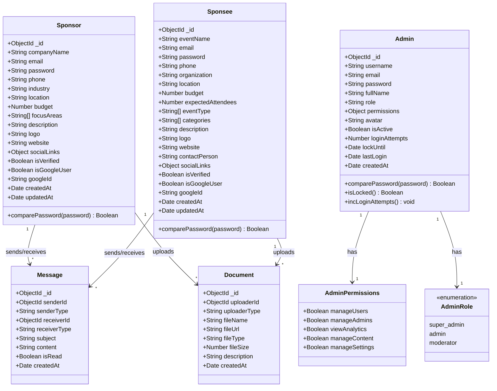
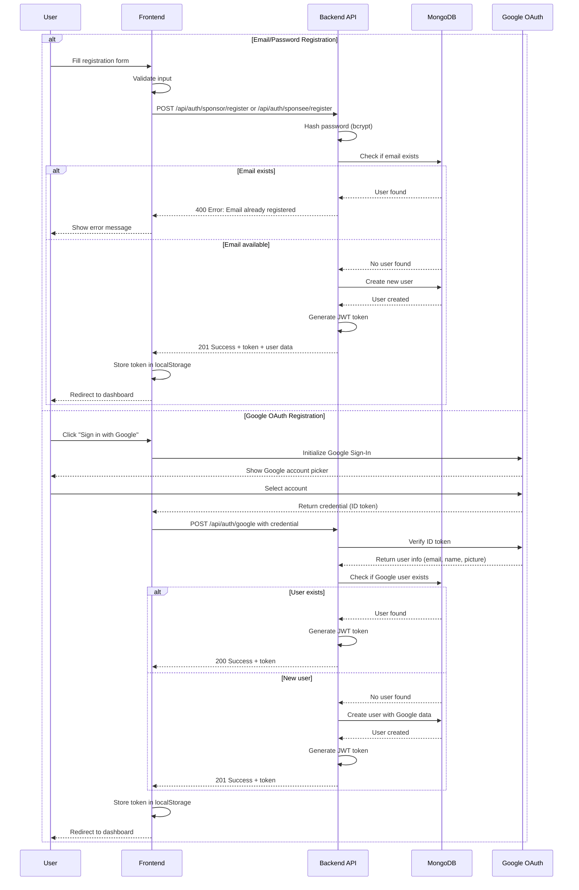
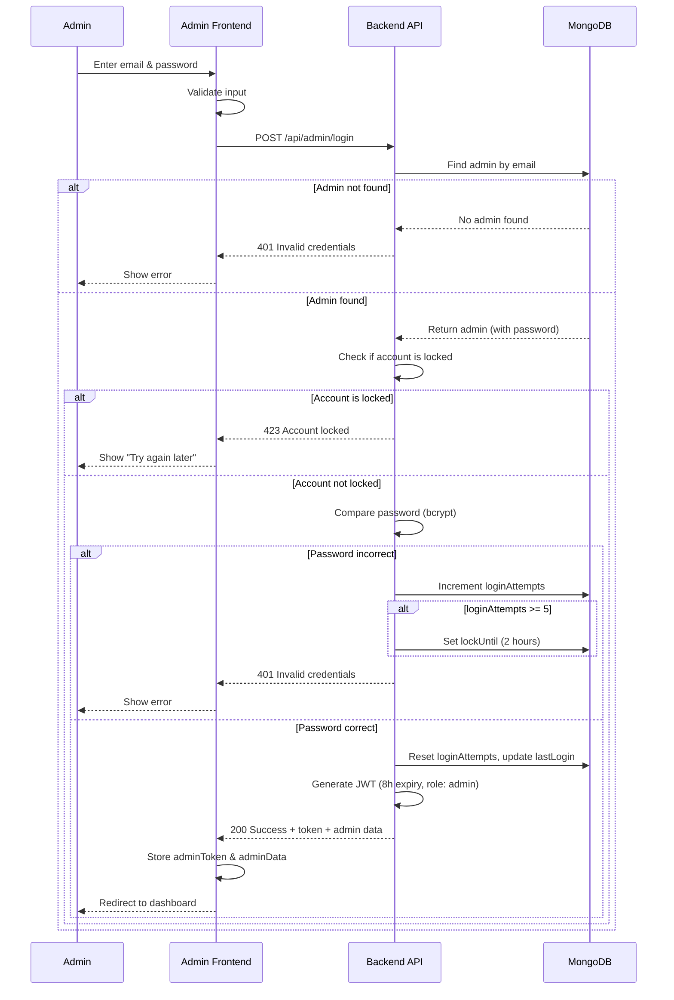
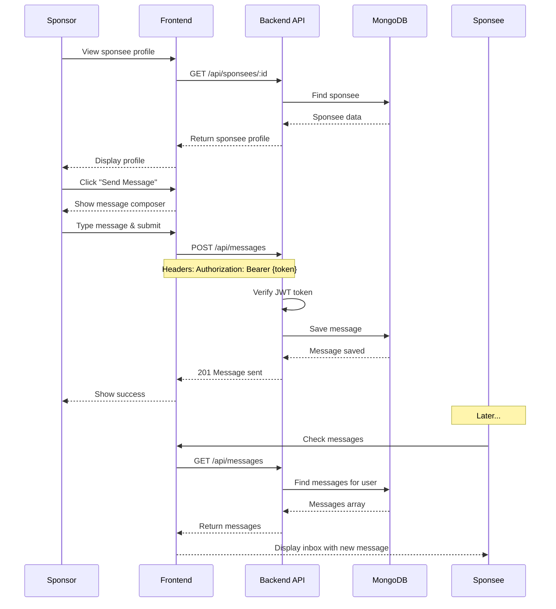
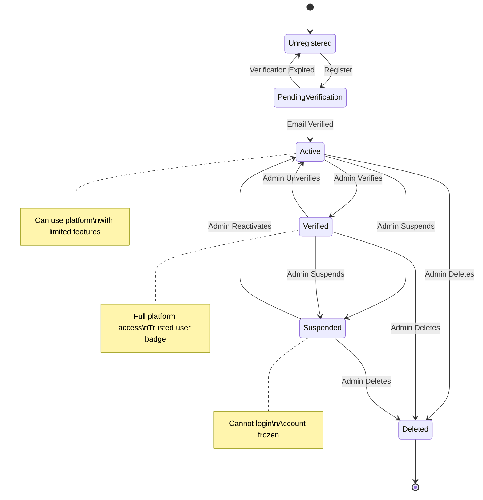
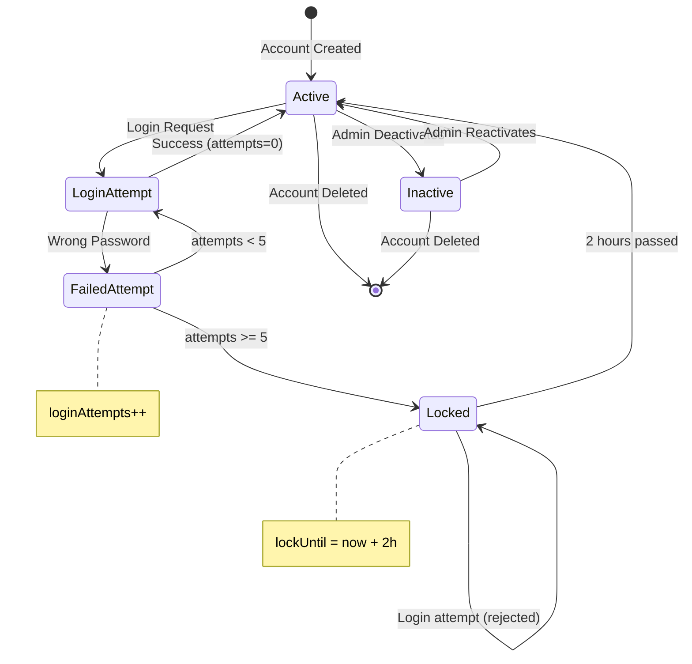
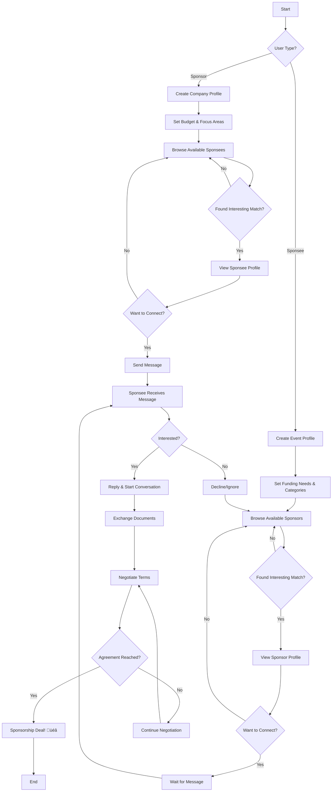
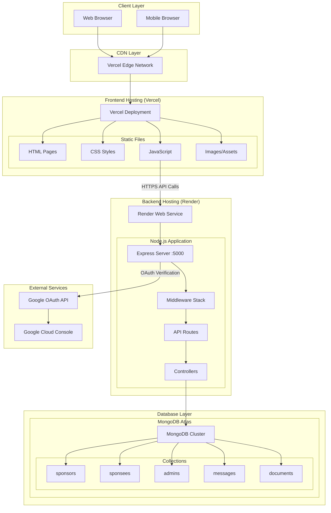
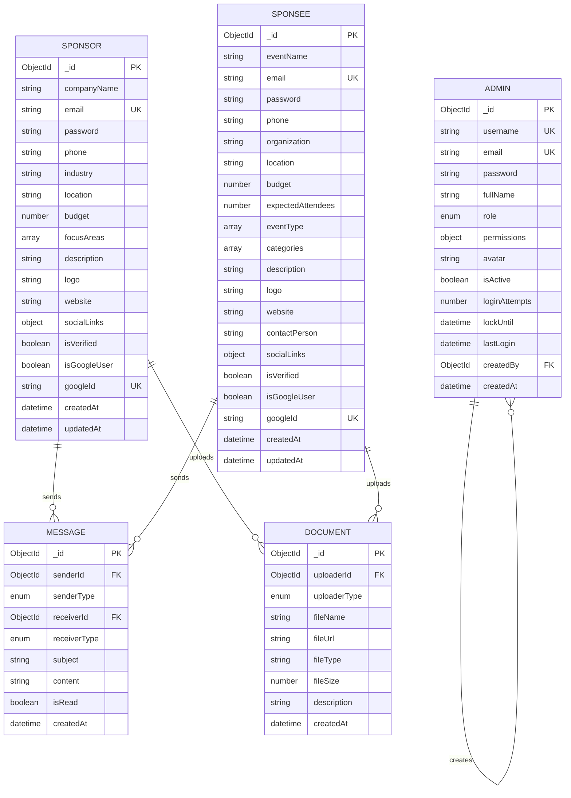
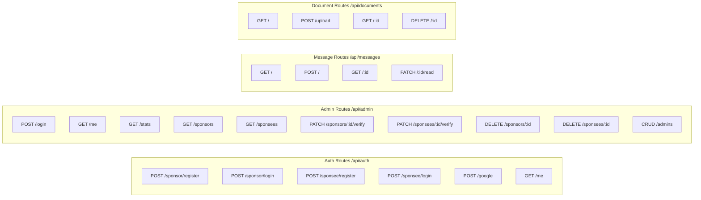

# SponzoBD - UML Diagrams

Comprehensive UML diagrams documenting the functionalities and features of the SponzoBD sponsorship matching platform.

---

## 1. Use Case Diagram

```mermaid
graph TB
    subgraph Actors
        S[👤 Sponsor]
        SP[👤 Sponsee/Micro-Influencer]
        A[👤 Admin]
        SA[👤 Super Admin]
        G[üåê Google OAuth]
    end

    subgraph "Authentication System"
        UC1[Register Account]
        UC2[Login with Email/Password]
        UC3[Login with Google OAuth]
        UC4[Reset Password]
        UC5[Email Verification]
    end

    subgraph "Sponsor Features"
        UC6[Create Company Profile]
        UC7[Set Sponsorship Budget]
        UC8[Define Focus Areas]
        UC9[Browse Sponsees/Events]
        UC10[Send Messages]
        UC11[View Sponsee Profiles]
        UC12[Upload Documents]
        UC13[Manage Profile]
    end

    subgraph "Sponsee Features"
        UC14[Create Event Profile]
        UC15[Set Funding Requirements]
        UC16[Define Event Categories]
        UC17[Browse Sponsors]
        UC18[Receive Messages]
        UC19[View Sponsor Profiles]
        UC20[Upload Event Documents]
        UC21[Manage Event Profile]
    end

    subgraph "Admin Features"
        UC22[View Dashboard Analytics]
        UC23[Manage Sponsors]
        UC24[Manage Sponsees]
        UC25[Verify Users]
        UC26[Delete Users]
        UC27[View Messages]
        UC28[View Documents]
    end

    subgraph "Super Admin Features"
        UC29[Manage Admin Users]
        UC30[Create New Admins]
        UC31[Set Admin Permissions]
        UC32[Full System Access]
    end

    %% Sponsor connections
    S --> UC1
    S --> UC2
    S --> UC3
    S --> UC6
    S --> UC7
    S --> UC8
    S --> UC9
    S --> UC10
    S --> UC11
    S --> UC12
    S --> UC13

    %% Sponsee connections
    SP --> UC1
    SP --> UC2
    SP --> UC3
    SP --> UC14
    SP --> UC15
    SP --> UC16
    SP --> UC17
    SP --> UC18
    SP --> UC19
    SP --> UC20
    SP --> UC21

    %% Admin connections
    A --> UC22
    A --> UC23
    A --> UC24
    A --> UC25
    A --> UC26
    A --> UC27
    A --> UC28

    %% Super Admin connections
    SA --> UC22
    SA --> UC23
    SA --> UC24
    SA --> UC25
    SA --> UC26
    SA --> UC27
    SA --> UC28
    SA --> UC29
    SA --> UC30
    SA --> UC31
    SA --> UC32

    %% Google OAuth
    G -.-> UC3
```

---

## 2. Class Diagram (Data Models)

```mermaid
classDiagram
    class Sponsor {
        +ObjectId _id
        +String companyName
        +String email
        +String password
        +String phone
        +String industry
        +String location
        +Number budget
        +String[] focusAreas
        +String description
        +String logo
        +String website
        +Object socialLinks
        +Boolean isVerified
        +Boolean isGoogleUser
        +String googleId
        +Date createdAt
        +Date updatedAt
        +comparePassword(password) Boolean
    }

    class Sponsee {
        +ObjectId _id
        +String eventName
        +String email
        +String password
        +String phone
        +String organization
        +String location
        +Number budget
        +Number expectedAttendees
        +String[] eventType
        +String[] categories
        +String description
        +String logo
        +String website
        +String contactPerson
        +Object socialLinks
        +Boolean isVerified
        +Boolean isGoogleUser
        +String googleId
        +Date createdAt
        +Date updatedAt
        +comparePassword(password) Boolean
    }

    class Admin {
        +ObjectId _id
        +String username
        +String email
        +String password
        +String fullName
        +String role
        +Object permissions
        +String avatar
        +Boolean isActive
        +Number loginAttempts
        +Date lockUntil
        +Date lastLogin
        +Date createdAt
        +comparePassword(password) Boolean
        +isLocked() Boolean
        +incLoginAttempts() void
    }

    class Message {
        +ObjectId _id
        +ObjectId senderId
        +String senderType
        +ObjectId receiverId
        +String receiverType
        +String subject
        +String content
        +Boolean isRead
        +Date createdAt
    }

    class Document {
        +ObjectId _id
        +ObjectId uploaderId
        +String uploaderType
        +String fileName
        +String fileUrl
        +String fileType
        +Number fileSize
        +String description
        +Date createdAt
    }

    class AdminPermissions {
        +Boolean manageUsers
        +Boolean manageAdmins
        +Boolean viewAnalytics
        +Boolean manageContent
        +Boolean manageSettings
    }

    class AdminRole {
        <<enumeration>>
        super_admin
        admin
        moderator
    }

    Sponsor "1" --> "*" Message : sends/receives
    Sponsee "1" --> "*" Message : sends/receives
    Sponsor "1" --> "*" Document : uploads
    Sponsee "1" --> "*" Document : uploads
    Admin "1" --> "1" AdminPermissions : has
    Admin "1" --> "1" AdminRole : has
```

---

## 3. Sequence Diagram - User Registration Flow

```mermaid
sequenceDiagram
    participant U as User
    participant F as Frontend
    participant B as Backend API
    participant DB as MongoDB
    participant G as Google OAuth

    alt Email/Password Registration
        U->>F: Fill registration form
        F->>F: Validate input
        F->>B: POST /api/auth/sponsor/register or /api/auth/sponsee/register
        B->>B: Hash password (bcrypt)
        B->>DB: Check if email exists
        alt Email exists
            DB-->>B: User found
            B-->>F: 400 Error: Email already registered
            F-->>U: Show error message
        else Email available
            DB-->>B: No user found
            B->>DB: Create new user
            DB-->>B: User created
            B->>B: Generate JWT token
            B-->>F: 201 Success + token + user data
            F->>F: Store token in localStorage
            F-->>U: Redirect to dashboard
        end
    else Google OAuth Registration
        U->>F: Click "Sign in with Google"
        F->>G: Initialize Google Sign-In
        G-->>U: Show Google account picker
        U->>G: Select account
        G-->>F: Return credential (ID token)
        F->>B: POST /api/auth/google with credential
        B->>G: Verify ID token
        G-->>B: Return user info (email, name, picture)
        B->>DB: Check if Google user exists
        alt User exists
            DB-->>B: User found
            B->>B: Generate JWT token
            B-->>F: 200 Success + token
        else New user
            DB-->>B: No user found
            B->>DB: Create user with Google data
            DB-->>B: User created
            B->>B: Generate JWT token
            B-->>F: 201 Success + token
        end
        F->>F: Store token in localStorage
        F-->>U: Redirect to dashboard
    end
```

---

## 4. Sequence Diagram - Admin Login with Security

```mermaid
sequenceDiagram
    participant A as Admin
    participant F as Admin Frontend
    participant B as Backend API
    participant DB as MongoDB

    A->>F: Enter email & password
    F->>F: Validate input
    F->>B: POST /api/admin/login
    B->>DB: Find admin by email

    alt Admin not found
        DB-->>B: No admin found
        B-->>F: 401 Invalid credentials
        F-->>A: Show error
    else Admin found
        DB-->>B: Return admin (with password)
        B->>B: Check if account is locked

        alt Account is locked
            B-->>F: 423 Account locked
            F-->>A: Show "Try again later"
        else Account not locked
            B->>B: Compare password (bcrypt)

            alt Password incorrect
                B->>DB: Increment loginAttempts
                alt loginAttempts >= 5
                    B->>DB: Set lockUntil (2 hours)
                end
                B-->>F: 401 Invalid credentials
                F-->>A: Show error
            else Password correct
                B->>DB: Reset loginAttempts, update lastLogin
                B->>B: Generate JWT (8h expiry, role: admin)
                B-->>F: 200 Success + token + admin data
                F->>F: Store adminToken & adminData
                F-->>A: Redirect to dashboard
            end
        end
    end
```

---

## 5. Sequence Diagram - Messaging Flow

```mermaid
sequenceDiagram
    participant S as Sponsor
    participant F as Frontend
    participant B as Backend API
    participant DB as MongoDB
    participant SP as Sponsee

    S->>F: View sponsee profile
    F->>B: GET /api/sponsees/:id
    B->>DB: Find sponsee
    DB-->>B: Sponsee data
    B-->>F: Return sponsee profile
    F-->>S: Display profile

    S->>F: Click "Send Message"
    F-->>S: Show message composer
    S->>F: Type message & submit
    F->>B: POST /api/messages
    Note over F,B: Headers: Authorization: Bearer {token}
    B->>B: Verify JWT token
    B->>DB: Save message
    DB-->>B: Message saved
    B-->>F: 201 Message sent
    F-->>S: Show success

    Note over SP: Later...
    SP->>F: Check messages
    F->>B: GET /api/messages
    B->>DB: Find messages for user
    DB-->>B: Messages array
    B-->>F: Return messages
    F-->>SP: Display inbox with new message
```

---

## 6. Component Diagram

```mermaid
graph TB
    subgraph "Frontend (Vercel)"
        subgraph "Public Pages"
            LP[Landing Page]
            AB[About Page]
        end

        subgraph "Auth Pages"
            LG[Login Page]
            SU[Signup Pages]
            FP[Forgot Password]
        end

        subgraph "User Dashboards"
            SD[Sponsor Dashboard]
            SPD[Sponsee Dashboard]
            SP_P[Sponsor Profile]
            SPE_P[Sponsee Profile]
        end

        subgraph "Feature Pages"
            MSG[Messages Page]
            DOC[Documents Page]
            EVT[Events Pages]
        end

        subgraph "Admin Panel"
            ADL[Admin Login]
            ADB[Admin Dashboard]
            ASP[Sponsors Management]
            ASPE[Sponsees Management]
        end

        subgraph "Shared Components"
            NAV[Navbar Component]
            CSS[Styles/CSS]
        end
    end

    subgraph "Backend (Render)"
        subgraph "Express Server"
            SRV[server.js]
        end

        subgraph "Routes"
            AR[Auth Routes]
            ADR[Admin Routes]
            MR[Message Routes]
            DR[Document Routes]
        end

        subgraph "Controllers"
            AC[Auth Controller]
        end

        subgraph "Middleware"
            AM[Auth Middleware]
            AAM[Admin Auth Middleware]
        end

        subgraph "Models"
            SM[Sponsor Model]
            SPM[Sponsee Model]
            ADM[Admin Model]
            MM[Message Model]
            DM[Document Model]
        end

        subgraph "Config"
            DBC[Database Config]
        end
    end

    subgraph "External Services"
        MDB[(MongoDB Atlas)]
        GOA[Google OAuth]
        VRC[Vercel CDN]
        RND[Render Hosting]
    end

    LP --> NAV
    SD --> NAV
    SPD --> NAV

    LG --> AR
    SU --> AR
    SD --> AR
    SPD --> AR

    ADB --> ADR
    ASP --> ADR
    ASPE --> ADR

    MSG --> MR
    DOC --> DR

    AR --> AC
    AR --> AM
    ADR --> AAM

    AC --> SM
    AC --> SPM
    ADR --> ADM
    MR --> MM
    DR --> DM

    SM --> DBC
    SPM --> DBC
    ADM --> DBC
    DBC --> MDB

    LG --> GOA
    SU --> GOA

    LP --> VRC
    SRV --> RND
```

---

## 7. State Diagram - User Account States

```mermaid
stateDiagram-v2
    [*] --> Unregistered

    Unregistered --> PendingVerification: Register
    PendingVerification --> Active: Email Verified
    PendingVerification --> Unregistered: Verification Expired

    Active --> Verified: Admin Verifies
    Active --> Suspended: Admin Suspends
    Active --> Deleted: Admin Deletes

    Verified --> Suspended: Admin Suspends
    Verified --> Active: Admin Unverifies
    Verified --> Deleted: Admin Deletes

    Suspended --> Active: Admin Reactivates
    Suspended --> Deleted: Admin Deletes

    Deleted --> [*]

    note right of Active: Can use platform\nwith limited features
    note right of Verified: Full platform access\nTrusted user badge
    note right of Suspended: Cannot login\nAccount frozen
```

---

## 8. State Diagram - Admin Account Security

```mermaid
stateDiagram-v2
    [*] --> Active: Account Created

    Active --> LoginAttempt: Login Request

    LoginAttempt --> Active: Success (attempts=0)
    LoginAttempt --> FailedAttempt: Wrong Password

    FailedAttempt --> LoginAttempt: attempts < 5
    FailedAttempt --> Locked: attempts >= 5

    Locked --> Active: 2 hours passed
    Locked --> Locked: Login attempt (rejected)

    Active --> Inactive: Admin Deactivates
    Inactive --> Active: Admin Reactivates

    Active --> [*]: Account Deleted
    Inactive --> [*]: Account Deleted

    note right of Locked: lockUntil = now + 2h
    note right of FailedAttempt: loginAttempts++
```

---

## 9. Activity Diagram - Sponsor-Sponsee Matching Flow

```mermaid
flowchart TD
    A[Start] --> B{User Type?}

    B -->|Sponsor| C[Create Company Profile]
    B -->|Sponsee| D[Create Event Profile]

    C --> E[Set Budget & Focus Areas]
    D --> F[Set Funding Needs & Categories]

    E --> G[Browse Available Sponsees]
    F --> H[Browse Available Sponsors]

    G --> I{Found Interesting Match?}
    H --> J{Found Interesting Match?}

    I -->|Yes| K[View Sponsee Profile]
    I -->|No| G
    J -->|Yes| L[View Sponsor Profile]
    J -->|No| H

    K --> M{Want to Connect?}
    L --> N{Want to Connect?}

    M -->|Yes| O[Send Message]
    M -->|No| G
    N -->|Yes| P[Wait for Message]
    N -->|No| H

    O --> Q[Sponsee Receives Message]
    P --> Q

    Q --> R{Interested?}
    R -->|Yes| S[Reply & Start Conversation]
    R -->|No| T[Decline/Ignore]

    S --> U[Exchange Documents]
    T --> H

    U --> V[Negotiate Terms]
    V --> W{Agreement Reached?}

    W -->|Yes| X[Sponsorship Deal! üéâ]
    W -->|No| Y[Continue Negotiation]
    Y --> V

    X --> Z[End]
```

---

## 10. Deployment Diagram

```mermaid
graph TB
    subgraph "Client Layer"
        WB[Web Browser]
        MB[Mobile Browser]
    end

    subgraph "CDN Layer"
        VC[Vercel Edge Network]
    end

    subgraph "Frontend Hosting (Vercel)"
        VD[Vercel Deployment]
        subgraph "Static Files"
            HTML[HTML Pages]
            CSS_F[CSS Styles]
            JS[JavaScript]
            IMG[Images/Assets]
        end
    end

    subgraph "Backend Hosting (Render)"
        RD[Render Web Service]
        subgraph "Node.js Application"
            EX[Express Server :5000]
            MW[Middleware Stack]
            RT[API Routes]
            CT[Controllers]
        end
    end

    subgraph "Database Layer"
        subgraph "MongoDB Atlas"
            MC[MongoDB Cluster]
            subgraph "Collections"
                SC[sponsors]
                SPC[sponsees]
                AC[admins]
                MSC[messages]
                DC[documents]
            end
        end
    end

    subgraph "External Services"
        GA[Google OAuth API]
        GC[Google Cloud Console]
    end

    WB --> VC
    MB --> VC
    VC --> VD
    VD --> HTML
    VD --> CSS_F
    VD --> JS
    VD --> IMG

    JS -->|HTTPS API Calls| RD
    RD --> EX
    EX --> MW
    MW --> RT
    RT --> CT
    CT --> MC

    EX -->|OAuth Verification| GA
    GA --> GC

    MC --> SC
    MC --> SPC
    MC --> AC
    MC --> MSC
    MC --> DC
```

---

## 11. Entity Relationship Diagram (ERD)

```mermaid
erDiagram
    SPONSOR ||--o{ MESSAGE : "sends"
    SPONSOR ||--o{ DOCUMENT : "uploads"
    SPONSEE ||--o{ MESSAGE : "sends"
    SPONSEE ||--o{ DOCUMENT : "uploads"
    ADMIN ||--o{ ADMIN : "creates"

    SPONSOR {
        ObjectId _id PK
        string companyName
        string email UK
        string password
        string phone
        string industry
        string location
        number budget
        array focusAreas
        string description
        string logo
        string website
        object socialLinks
        boolean isVerified
        boolean isGoogleUser
        string googleId UK
        datetime createdAt
        datetime updatedAt
    }

    SPONSEE {
        ObjectId _id PK
        string eventName
        string email UK
        string password
        string phone
        string organization
        string location
        number budget
        number expectedAttendees
        array eventType
        array categories
        string description
        string logo
        string website
        string contactPerson
        object socialLinks
        boolean isVerified
        boolean isGoogleUser
        string googleId UK
        datetime createdAt
        datetime updatedAt
    }

    ADMIN {
        ObjectId _id PK
        string username UK
        string email UK
        string password
        string fullName
        enum role
        object permissions
        string avatar
        boolean isActive
        number loginAttempts
        datetime lockUntil
        datetime lastLogin
        ObjectId createdBy FK
        datetime createdAt
    }

    MESSAGE {
        ObjectId _id PK
        ObjectId senderId FK
        enum senderType
        ObjectId receiverId FK
        enum receiverType
        string subject
        string content
        boolean isRead
        datetime createdAt
    }

    DOCUMENT {
        ObjectId _id PK
        ObjectId uploaderId FK
        enum uploaderType
        string fileName
        string fileUrl
        string fileType
        number fileSize
        string description
        datetime createdAt
    }
```

---

## 12. Feature Matrix

| Feature              | Sponsor       | Sponsee       | Admin    | Super Admin |
| -------------------- | ------------- | ------------- | -------- | ----------- |
| Register Account     | ‚úÖ            | ‚úÖ            | ‚ùå       | ‚ùå          |
| Google OAuth Login   | ‚úÖ            | ‚úÖ            | ‚ùå       | ‚ùå          |
| Email/Password Login | ‚úÖ            | ‚úÖ            | ‚úÖ       | ‚úÖ          |
| Create Profile       | ‚úÖ            | ‚úÖ            | ‚ùå       | ‚ùå          |
| Edit Profile         | ‚úÖ            | ‚úÖ            | ‚ùå       | ‚ùå          |
| Browse Users         | ‚úÖ (Sponsees) | ‚úÖ (Sponsors) | ‚úÖ (All) | ‚úÖ (All)    |
| Send Messages        | ‚úÖ            | ‚úÖ            | ‚ùå       | ‚ùå          |
| Receive Messages     | ‚úÖ            | ‚úÖ            | ‚ùå       | ‚ùå          |
| Upload Documents     | ‚úÖ            | ‚úÖ            | ‚ùå       | ‚ùå          |
| View Dashboard       | ‚úÖ            | ‚úÖ            | ‚úÖ       | ‚úÖ          |
| View Analytics       | ‚ùå            | ‚ùå            | ‚úÖ       | ‚úÖ          |
| Verify Users         | ‚ùå            | ‚ùå            | ‚úÖ       | ‚úÖ          |
| Delete Users         | ‚ùå            | ‚ùå            | ‚úÖ       | ‚úÖ          |
| Manage Admins        | ‚ùå            | ‚ùå            | ‚ùå       | ‚úÖ          |
| System Settings      | ‚ùå            | ‚ùå            | ‚ùå       | ‚úÖ          |

---

## 13. API Endpoints Summary

```mermaid
graph LR
    subgraph "Auth Routes /api/auth"
        A1[POST /sponsor/register]
        A2[POST /sponsor/login]
        A3[POST /sponsee/register]
        A4[POST /sponsee/login]
        A5[POST /google]
        A6[GET /me]
    end

    subgraph "Admin Routes /api/admin"
        B1[POST /login]
        B2[GET /me]
        B3[GET /stats]
        B4[GET /sponsors]
        B5[GET /sponsees]
        B6[PATCH /sponsors/:id/verify]
        B7[PATCH /sponsees/:id/verify]
        B8[DELETE /sponsors/:id]
        B9[DELETE /sponsees/:id]
        B10[CRUD /admins]
    end

    subgraph "Message Routes /api/messages"
        C1[GET /]
        C2[POST /]
        C3[GET /:id]
        C4[PATCH /:id/read]
    end

    subgraph "Document Routes /api/documents"
        D1[GET /]
        D2[POST /upload]
        D3[GET /:id]
        D4[DELETE /:id]
    end
```

---

## How to View These Diagrams

1. **GitHub**: Copy this file to your repository - GitHub renders Mermaid diagrams automatically
2. **VS Code**: Install the "Markdown Preview Mermaid Support" extension
3. **Online**: Use [Mermaid Live Editor](https://mermaid.live/) - paste the code blocks
4. **Documentation**: Use tools like Docusaurus, GitBook, or Notion that support Mermaid

---

_Generated for SponzoBD - Sponsorship Matching Platform_
_Last Updated: December 26, 2025_
